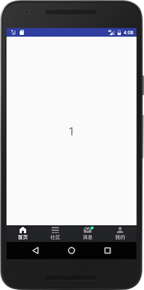

# XSTabActivity

封装了底部菜单及其常用操作



主要功能如下：

1、可自由选择【文本菜单】【图标菜单】【图标+文本菜单】，通过如下方法控制：

```
    /**
     * @return 是否显示菜单图标
     */
    public boolean isShowIcon() {
        return true;
    }

    /**
     * @return 是否显示菜单文字
     */
    public boolean isShowTitle() {
        return true;
    }
```

2、每个菜单都有相应的提示点，通过如下方法控制

```

public void showTipPoint(XSTab xsTab);
public void showTipPointByName(int... tabNameList);
public void hideTipPoint(XSTab xsTab);

```

示例图中，消息菜单即为显示提示点，其它为不显示

3、使用XSTabActivity后，只需通过如下方法传入菜单的相关信息即可，

```
public List<XSTab> getXSTab();
```

具体代码如下：


```
package com.xiaosuokeji.tabactivity.example.activity;

import com.xiaosuokeji.framework.android.xstabactivity.XSTab;
import com.xiaosuokeji.framework.android.xstabactivity.XSTabActivity;
import com.xiaosuokeji.tabactivity.example.R;
import com.xiaosuokeji.tabactivity.example.fragment.Fragment1;
import com.xiaosuokeji.tabactivity.example.fragment.Fragment2;
import com.xiaosuokeji.tabactivity.example.fragment.Fragment3;
import com.xiaosuokeji.tabactivity.example.fragment.Fragment4;

import java.util.ArrayList;
import java.util.List;

public class MainActivity extends XSTabActivity {

    @Override
    public List<XSTab> getXSTab() {
        List<XSTab> xsTabList = new ArrayList<>();

        xsTabList.add(new XSTab(R.string.tabName1, R.mipmap.tab_image_nor_1, R.mipmap.tab_image_sel_1, Fragment1.class, true));
        xsTabList.add(new XSTab(R.string.tabName2, R.mipmap.tab_image_nor_2, R.mipmap.tab_image_sel_2, Fragment2.class));
        xsTabList.add(new XSTab(R.string.tabName3, R.mipmap.tab_image_nor_3, R.mipmap.tab_image_sel_3, Fragment3.class));
        xsTabList.add(new XSTab(R.string.tabName4, R.mipmap.tab_image_nor_4, R.mipmap.tab_image_sel_4, Fragment4.class));

        return xsTabList;
    }

    @Override
    public void afterTabClick(XSTab xsTab) {

        //切换Fragment后隐藏提示点
        hideTipPoint(xsTab);
    }

    @Override
    public void initContent() {

        //初始化时显示提示点
        showTipPointByName(R.string.tabName3);
    }
}


```